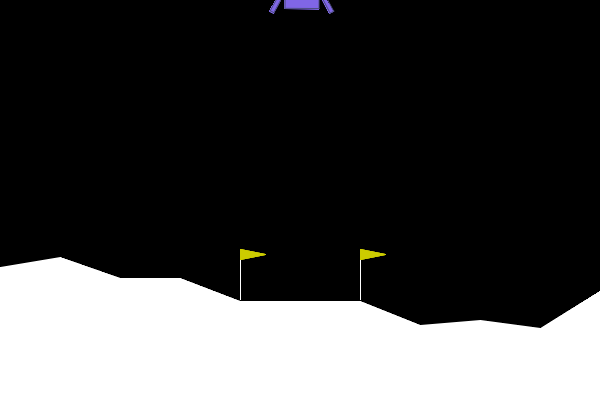

# Lunar Lander Actor-Critic

An advantage actor-critic (A2C) agent for the Lunar Lander environment.



### TL;DR Running the Program

The application runs on Ubuntu 24.04 with Docker Compose. Training happens on
the GPU, so the
[NVIDIA Container Toolkit](https://docs.nvidia.com/datacenter/cloud-native/container-toolkit/latest/install-guide.html)
should be installed.

```
docker compose up --build
```

It takes a while for the the training to complete, 10 minutes or so. During,
training, and when the training is complete, episodes are periodically rendered
to the `data/` directory as animated GIFs.

### Overview

The [Lunar Lander environment](https://gymnasium.farama.org/environments/box2d/lunar_lander/)
is part of [Gynmasium](https://gymnasium.farama.org/), which is a maintained
fork of OpenAI Gym. It has an eight-dimensional observation space ("state"
$s$)—x and y coordinates, x and y velocities, the lander's angle and angular
velocity, and booleans that indicate if the legs are touching the ground.

There are four actions: nothing, left engine, main engine, and right engine.

The goal is to land the craft between two flags.

A complex reward $r$ is given at each step. Its value is based on how much the
lander is tilted, how fast it's traveling, if it's touching the ground, if it's
near the flags, and how much the engines are being used. An additional reward
(100) is given for landing, or a negative reward for crashing (-100).

Training is considered complete when the agent gets an average reward of 200
over 100 episodes.

### Algorithm

[Actor-critic algorithms](https://inria.hal.science/hal-00840470/document) use
two neural networks. The Actor learns to predict action probabilities, so one
output per action, the outputs ideally summing to 1\. (The raw outputs, referred
to as "logits", are passed through a
[softmax function](https://en.wikipedia.org/wiki/Softmax_function).) These
predictions thus form the policy, $\pi$ (pi).

The Critic predicts the total "return", $G$, for taking an action and continuing
to follow the policy $\pi$. (More on $G$ below, but it's
a measure of the total reward from a state to the end of an episode.)

In this implementation, the two networks are combined. The inputs—the
environment state, $s$—are shared, as well as a common "hidden" layer. This
combining of the networks allows for faster training because a single GPU can be
utilized.

The agent runs one full episode at a time. At each step, the environment state
$s_t$ is given to the Actor and Critic, respectively yielding an action
probability distribution prediction, and a predicted value $V$ of the state ($V$
is a predition of $G$, which, again, will be described below). An action is
chosen from the Actor's predictions using `tensorflowf.random.categorical`. This
random categorical choice _mostly_ follows the Actor's policy,
$a_t = argmax(\pi[s_t])$, but allows for some exploration.

Action probability predictions, value predictions, and actual rewards are stored
in arrays for training.

#### Returns ($G$)

At the end of each episode, the actual rewards $R$ are converted into returns,
denoted $G$. These are the sums of the rewards from each timestep to the end of
the episode. So, for example, if the episode's rewards are `[1, 2, 3]`,
the returns will be `[6, 5, 3]`.

$$G_t = \sum_{t'=t}^T\gamma^{t'-t}r_{t'}$$

Where $\gamma$ (gamma) is a discount factor governing how much the agent prefers
current rewards over future rewards.

As a stabilization trick, the returns are standardized using
[Z-score normalization](https://en.wikipedia.org/wiki/Standard_score).

$$Z = \frac{G-\mu}{\sigma}$$

Where $\mu$ (mu) is the mean of $G$, and $\sigma$ (sigma) is the standard
deviation of $G$.

#### Critic Loss

The predicted values $V$ and returns $G$ are then used to train the Critic using
[Huber loss](https://en.wikipedia.org/wiki/Huber_loss) as a loss function. (MSE
would also work, but Huber loss is more stable in that it's less sensitive to
outliers.)

$$l_{critic} = huber(G,V)$$

#### Actor Loss

The Actor loss is more complicated. First an
[_advantage_](https://spinningup.openai.com/en/latest/spinningup/rl_intro.html#advantage-functions)
is calclated. It's the actual returns $G$ less the predicted values $V$, a
measure of how much _better_ or _worse_ the selected action $a_t$ from state
$s_t$ was than predicted, if policy $\pi$ were followed after that action.

$$A(s,a) = G(s,a)-V(s)$$

Note that, as described above, the rewards $G$ are normalized such that they
have a mean of 0 and a standard deviation of 1. Since the Critic predicts these
rewards, $V$ is _typically_ in this range as well, at least as training
progresses.

$A$ is multiplied by the natural log of the probabilies provided by the Actor,
i.e. the policy $\pi$, and negated. Note that the probability predictions form a
[probability distribution](https://en.wikipedia.org/wiki/Probability_distribution)
that sums to 1.

Some properties of natural log:

* $-ln(x)$ is asymptotic: $\lim\limits_{x\to0}-ln(x)=\infty$.
* $-ln(x)$ intercepts the x-axis when $x=1$.
* $\frac{d}{dx}-ln(x)*c=-\frac{c}{x}$. (This represents the gradients.)

The Actor loss is thus:

$$l_{actor} = -\sum_{t=1}^Tln[\pi(a_t|s_t)] * [G(s_t,a_t)-V(s_t)]$$

When the advantage $A$ is near 0, meaning that the value predictions are
accurate, the policy doesn't change much. Conversely, if $A$ is large, the
probability predictions that are near 0 have a steep gradient, and those near 1
have a relatively gradual gradient.

#### Total Loss

Because the Actor and Critic are combined into a single network, the Actor and
Critic losses are added together to form the total loss.

$$l_{total} = l_{critic} + l_{actor}$$

### References

The code in this repository is based largely on a Tensorflow tutorial,
[Playing CartPole with the Actor-Critic method](https://www.tensorflow.org/tutorials/reinforcement_learning/actor_critic).
Also, the
[RL Course by David Silver](https://youtube.com/playlist?list=PLzuuYNsE1EZAXYR4FJ75jcJseBmo4KQ9-&si=GbNdD73nvvHjIgGn)
has been invaluable.

* [Actor-Critic Algorithm in Reinforcement Learning](https://www.geeksforgeeks.org/machine-learning/actor-critic-algorithm-in-reinforcement-learning/)
* [CS285 Fall 2019](https://youtube.com/playlist?list=PLkFD6_40KJIwhWJpGazJ9VSj9CFMkb79A&si=I3LZBZnwDGiES1pV)
(particularly lecture 6 from 09/18/2019)
* [Everything You Need To Master Actor Critic Methods | Tensorflow 2 Tutorial](https://youtu.be/LawaN3BdI00?si=2vqNj0nxz7FQKsDt)
* [Key Concepts in RL](https://spinningup.openai.com/en/latest/spinningup/rl_intro.html)
* [Huber Loss](https://en.wikipedia.org/wiki/Huber_loss)
* [Natural Actor–Critic Algorithms](https://inria.hal.science/hal-00840470/document)
(particularly algorithm 3)
* [Playing CartPole with the Actor-Critic method](https://www.tensorflow.org/tutorials/reinforcement_learning/actor_critic)
* [RL Course by David Silver](https://youtube.com/playlist?list=PLzuuYNsE1EZAXYR4FJ75jcJseBmo4KQ9-&si=GbNdD73nvvHjIgGn)
* [Softmax Function](https://en.wikipedia.org/wiki/Softmax_function)
* [Z-Score Normalization](https://en.wikipedia.org/wiki/Standard_score)
